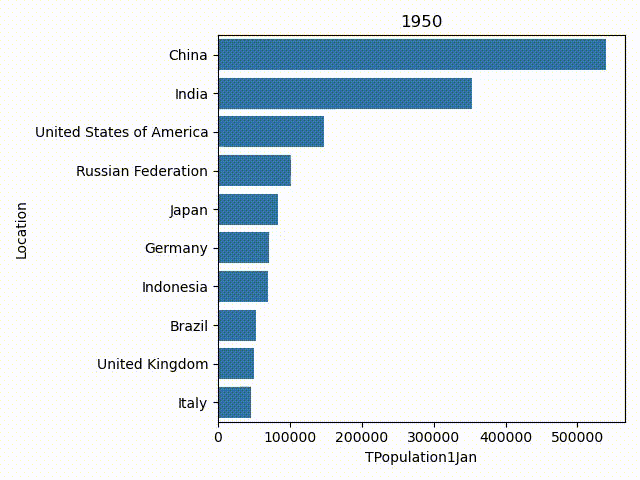

# Animating [Worldwide Population Data](https://www.kaggle.com/datasets/shivd24coder/worldwide-population-data)

This project is to demonstrate to animate matplotlib.pyplot plots.

To get started with the demo create the directory called `data/` in the root of this project. Download the [Worldwide Population Data](https://www.kaggle.com/datasets/shivd24coder/worldwide-population-data?select=WPP2022_Demographic_Indicators_Medium.csv) dataset, then unzip it in the `data/` directory.

In the demo I show how matplotlib could be used to easily create an animation like this

<!-- <video src="population.mp4" controls></video> -->

