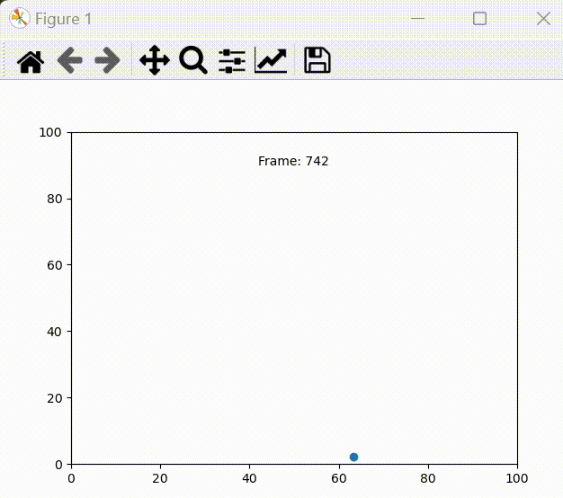
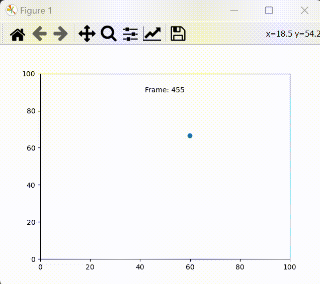

# Animating [Worldwide Population Data](https://www.kaggle.com/datasets/shivd24coder/worldwide-population-data)

This project is to demonstrate to animate matplotlib.pyplot plots.

To get started with the demo create the directory called `data/` in the root of this project. Download the [Worldwide Population Data](https://www.kaggle.com/datasets/shivd24coder/worldwide-population-data?select=WPP2022_Demographic_Indicators_Medium.csv) dataset, then unzip it in the `data/` directory.

In the demo I show how matplotlib could be used to easily create an animation like this

<!-- <video src="population.mp4" controls></video> -->

Try it right now by running 27 lines of [animation_demo.py](animation_demo.py), or look through how I developed the demo by reading through the [notebook](main.ipynb) that I was prototyping in.

Also check out [bouncyball.ipynb](bouncyball.ipynb) to see how bliting can seriously boost animation speed

No Blit

With Blit

